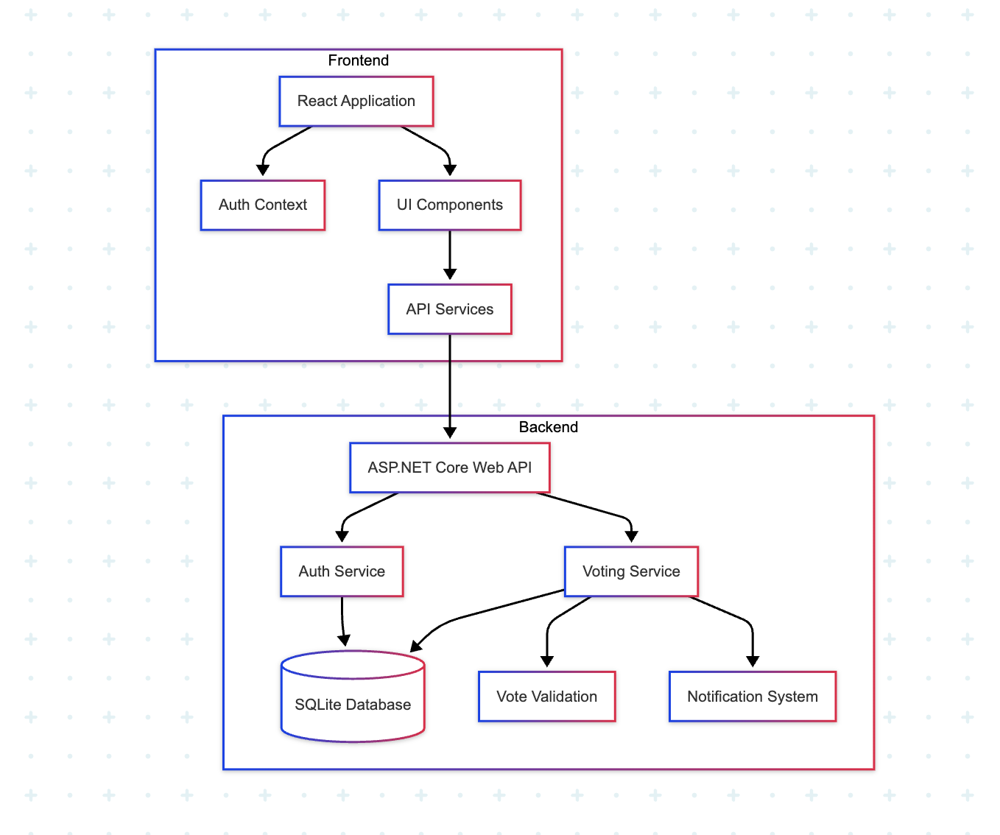
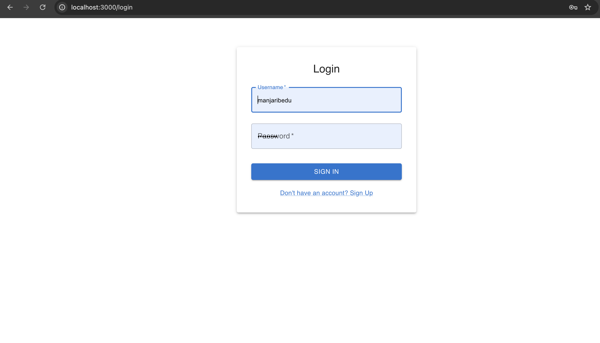
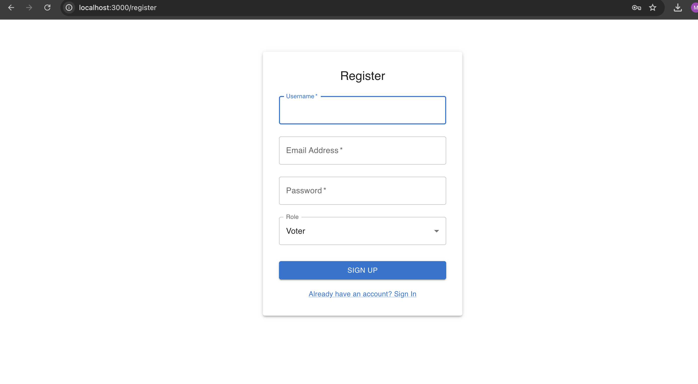
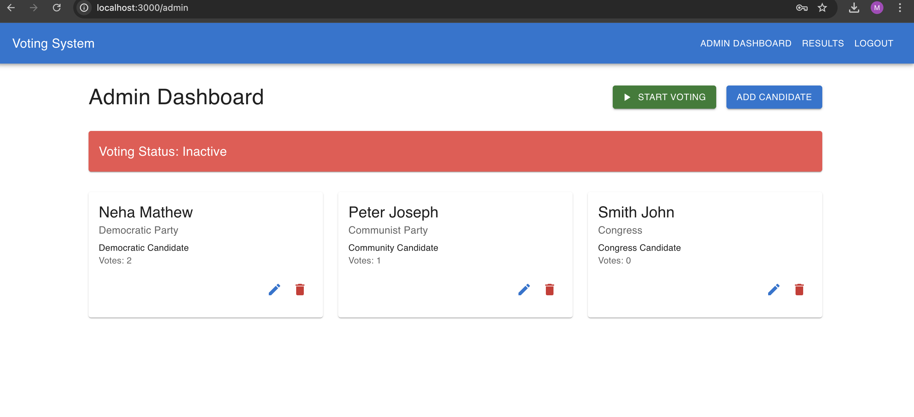
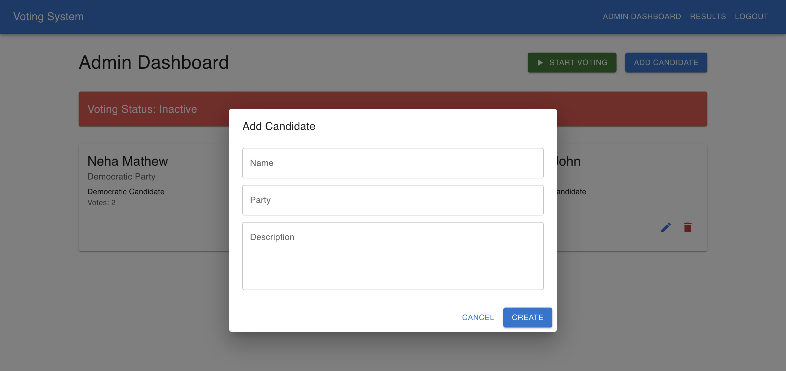
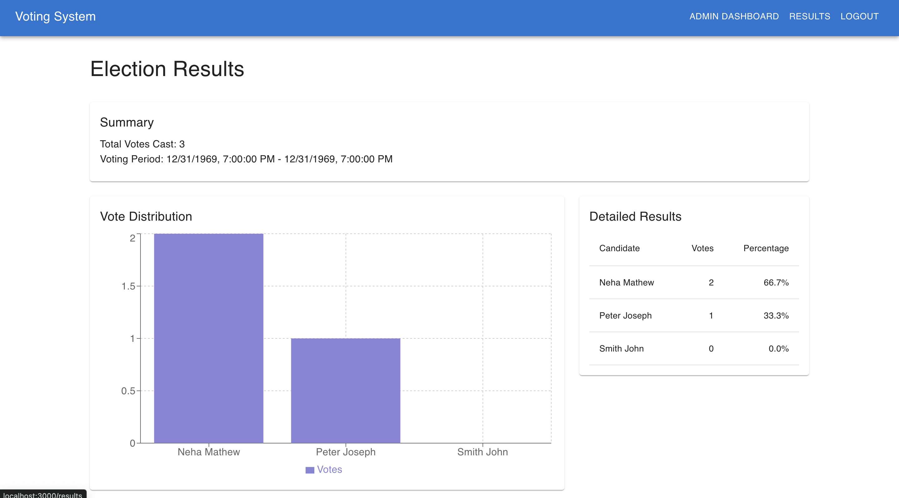
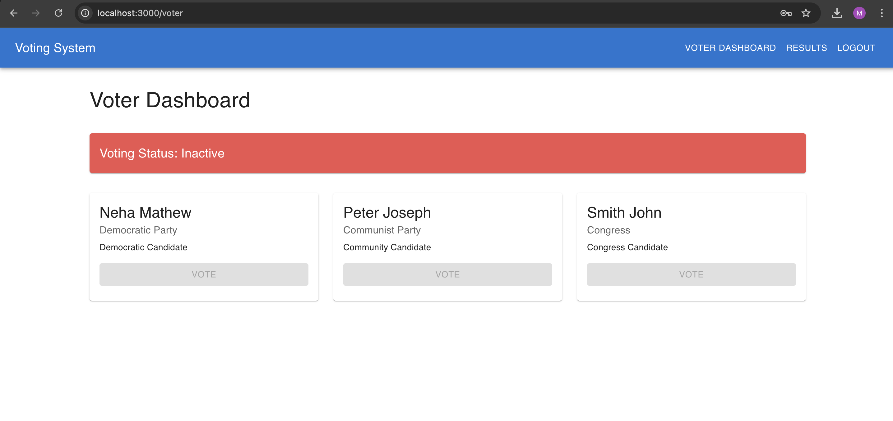
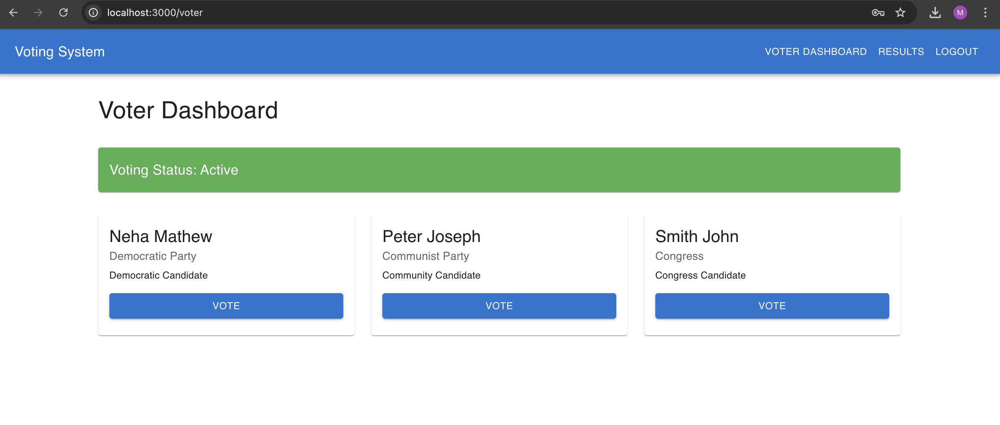
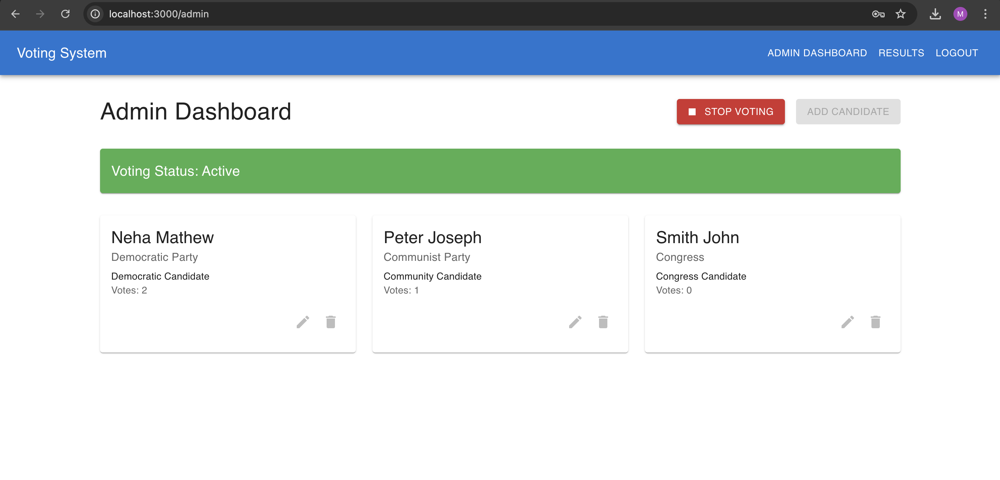

Secure Online Voting system

1.	Project Description

A web-based tool called the Secure Online Voting System was created to enable remote, impenetrable elections for businesses, academic institutions, or small-scale government surveys. Using cryptographic approaches, the system guarantees vote integrity, anonymity, and authentication while offering administrators and voters an intuitive user interface.

Principal Goals: 

• Make safe remote voting possible through mobile and online devices. 
• Stop ballot tampering and duplicate voting. 
• Offer audit trails and vote counting in real time. 
• Protect voter privacy (votes that are anonymous but verified). 

Component Diagram:

 

UML Diagram:

 

GitHub Url: https://github.com/Mbajpai007/Secure-Online-voting-Systems

Installation:

•	To run backend, open command prompt and go to project directory and add below commands.
cd MyApp
run dotnet

•	To run fromtend, open command prompt and go to project directory and add below commands.
cd client
npm start

Screenshots of Application:

•	Login Page

 

•	Registration Page
 

•	Admin Dashboard

 

•	Add Candidate

 

•	Result Dashboard

 

•	Voter Dashboard

 

•	When Voting is active, voter dashboard looks like 

 

•	When voting is active, admin dashboard looks like 

 

